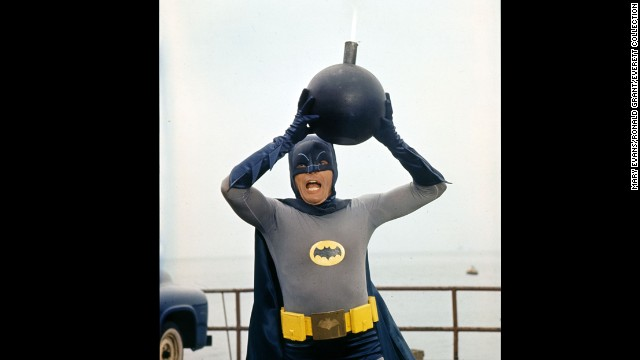

# hw01

This is Ram M Kripa's Homework 1 submission.
I think I understand the **github workflow** for the most part now.
I have used the *second option* listed on the course website (Local installation) because I already have a decent idea of how to use Github.
I am a rising ***sophomore*** at UC Berkeley and am really looking forward to the rest of this course. I primarily do research in Jupyter Notebooks, using Ipython. However, I would like to use R for research and for more Data Analysis projects in the future!
> I also really like the 1966 Batman Live action TV show. *Adam West* is a legend.

## Some Days you just can't get rid of a Bomb
